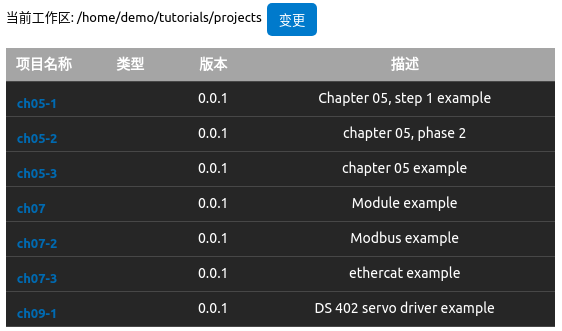

# Wasome PLC编程指南

Wasome WebIDE是一套现代的PLC编程开发IDE， 支持IEC61131-3编程语言，同时支持C、C++、Rust等多种计算机语言混合编程与调试。WasomeIDE基于最新的编程工具VSCODE开发， 提供功能丰富的编辑、编译、调试、模拟运行等功能。WasomeIDE目前支持在Ubuntu系统（18.04以上版本）上运行。

本文档的目标为帮助使用者使用WasomeIDE开发PLC应用程序。文档内容包含以下主要的组成部分：
-	快速入口
-	IEC61131-3语言编程基础
-	WasomeIDE系统函数库
-	使用IEC61131-3编程语言开发最小项目
-	使用内部模块开发示例
-	使用实际MODBUS, ETHERCAT设备开发示例
-	开发基于PLCOpen运动控制
-	开发伺服驱动
-	上位机程序开发

# 使用示例

## 准备

下载本代码仓库到本地：
```
git clone https://github.com/wasome-plc/tutorials.git
```

安装好Wasome IDE，并打开。

## 设置工作区
在IDE中设置项目工作区到刚才下载代码仓库的目录下`projects`子目录：



## 打开示例项目
从上图中点击任意项目打开

# 示例项目

## Chapter 05:使用ST语言开发最小项目
在本章里我们将使用ST语言开发一个最小的PLC应用，这个应用不会使用到IO内存访问。这个例子用来练习ST语言的常用编程语法，包含三个进阶。

### [进阶一](./projects/ch05-1)：

不使用IDE的图形界面编辑全局变量和任务，使用一个ST文件完成：
-	程序
-	基本的变量类型定义
-	主要语句方法（赋值，条件转跳，数据类型转换，循环）
-	打印
-	从IDE图形界面定义全局变量和任务

### [进阶二](./projects/ch05-2)：

ST程序包含更多的语法：
-	数组变量定义
-	结构类型定义
-	函数定义
-	功能块定义

### [进阶三](./projects/ch05-3)：

-	从ST程序定义资源与任务配置


### [进阶四](./projects/ch05-4)：

-	使用梯形图LD语言开发PLC应用


## Chapter 06:[使用内部模块开发示例](./projects/ch06)

在本章里我们将使用不同语言(C, C++, ST)在项目中创建一个内部模块来开发函数与功能块，其既可以被项目内部代码调用，也可以通过模块导出给其他项目开发使用。

这个例子主要用来练习内部模块的一般步骤，包含：
-	创建模块
-	定义模块接口文件
-	自动生成C/C++头文件与框架代码
-	实现模块
-	调用模块中的POU

## Chapter 07:使用内部模块开发示例

### 7.2	[MODBUS使用示例](./projects/ch07-2)

本示例第一次展示配置IO表操作，用于通讯MODBUS从站。示例主要展示：
-	配置IO表：建立程序变量和MODBUS寄存器之间的映射关系
-	ST程序：使用读入的MODBUS数据，计算写入MODBUS的数据
-	测试程序：python脚本将读写MODBUS寄存器用来验证ST程序的执行正确性

### 7.3	[ETHERCAT使用示例](./projects/ch07-3)

## Chapter 08: [开发基于PLCOpen运动控制](./projects/ch08-1)

在第8章中我们展示了如何在一个PLCOpen的应用中使用伺服驱动.

## Chapter 09: [开发伺服驱动](./projects/ch09-1)

这个例子会展示如何开发一个伺服驱动。基于Wasome PLC的驱动设计机制，使用PLCOpen运动控制库开发的PLC应用可以在不同电机类型上工作。

## Chapter 10: ["上位机"程序开发](./projects/ch10)

Wasome PLC系统基于边缘计算平台架构，内置了物联网通讯协议支持。严格意义上并不需要上位机，这个例子会展示如何开发一个和传统“上位机”程序来读写PLC应用的内存区。
