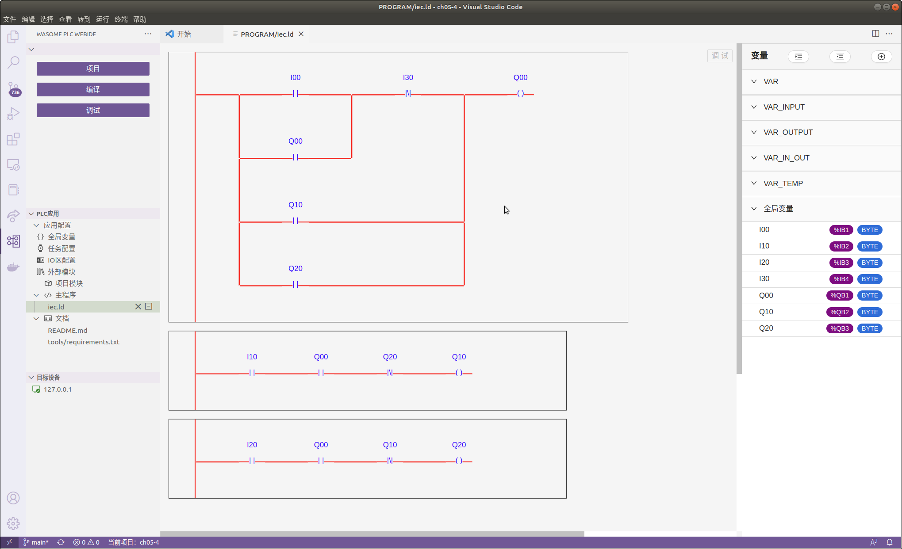

# 功能
  本PLC APP使用梯形图LD语言开发，实现PLC领域典型的互锁联锁装置
  IX00、IX30分别为启动、停止QX00的按钮，具有互锁限制
  IX10和IX20分别控制QX10和QX20|同时QX00是必要条件，对QX10和QX20具有联锁限制

# 逻辑

# 运行
- 1 目标机启动plc-manager， 在目标机的管理页面中”设备连接与配置“->"MODBUS从站（PLC应用）"中添加名称为device_cha05_4的从站,从站ID为1
- 2 启动modbus simulator来模拟互锁联锁装置
- 3 编译PLC APP
- 4 在WebIDE的“目标设备”中添加待调试运行PLC APP的目标机IP地址， 并设置该目标设备为缺省设备
- 5 点击目标设备的“部署运行当前应用”按钮进入plc的部署运行界面，完成后plc应该能进入running状态

# 测试
 - 1 按“运行”的步骤启动PLC APP
 - 2 pip3 install -r tool/requirements.txt
 - 3 python tool/run_test.py
   如果目标机不是本机， 请替换脚本中的ip地址127.0.0.1为目标机的IP，端口号post替换为device_cha05_4的从站设备的端口号，该脚本会使用API设置输入值， 利用API获取输出值，比较输出值与上表中的期望值是否一致， 一致则case pass   

## IO Mapping
  IX00 <---> device_cha05_4/1/81
  IX10 <---> device_cha05_4/1/82
  IX20 <---> device_cha05_4/1/83
  IX30 <---> device_cha05_4/1/84
  QX00 <---> device_cha05_4/1/91
  QX10 <---> device_cha05_4/1/92
  QX20 <---> device_cha05_4/1/93
   
## 输入输出映射表
  IX00|IX10|IX20|IX30|=>|QX00|QX10|QX20
  -:|:-:|:-:|:-:|:-:|:-:|:-:|:-
  1|1|0|0|=>|1|1|0
  1|0|1|0|=>|1|0|1
  1|1|1|0|=>|1|0|0
  0|0|0|1|=>|0|0|0
  0|1|0|1|=>|0|0|0
    

