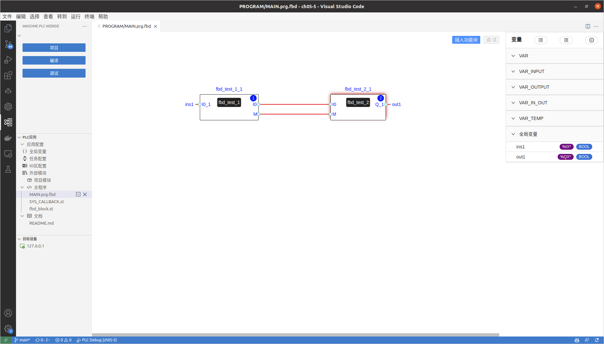

# 功能
  本PLC APP使用功能块图FBD语言开发，实现PLC领域传送带产品检测与次品分离
  I0_1为质量传感器输入，当传感器检测到次品时，I0_1为1，否则为0
  I0为光电开关输入，当传感器检测到产品时，I0为1，否则为0
  I0_2为推杆限位开关输入，触碰到产品时，I0_2的状态为1，否则为0
  Q_1为次品输出，当I0_1为1时，Q_1为1，否则为0

# 逻辑
功能块test_1
```js
FUNCTION_BLOCK fbd_test_1
    VAR_INPUT
        I0_1:BOOL;
    END_VAR
    VAR_OUTPUT
        I0:BOOL;
        M:BOOL;
    END_VAR
    VAR_TEMP
        __R0:BOOL;
    END_VAR
  IF I0_1=0  THEN
    I0:=1;
    M:= I0_1 AND I0;
  ELSIF I0_1= 1 THEN
      I0:=1;
      __R0:= I0_1 AND I0;
      M:=__R0 OR M;
  END_IF;
END_FUNCTION_BLOCK
```
功能块test_2
```js
FUNCTION_BLOCK fbd_test_2
    VAR_INPUT
        I0:BOOL;
        M:BOOL;
    END_VAR
    VAR_OUTPUT
        Q_1:BOOL;
    END_VAR
    VAR_TEMP
        I0_3:BOOL:=1;
    END_VAR
  IF I0=0 AND M=0 THEN
      Q_1:=0;
  ELSIF I0=0 AND M=1 THEN
      Q_1:=0;
    ELSIF I0=1 AND M=1 THEN
        Q_1:=1;
       IF Q_1=1 THEN
           I0_3:=0;
       END_IF;
  END_IF;
END_FUNCTION_BLOCK
```



# 运行
- 1 目标机启动plc-manager， 并且配置modbus总线 bus-1
- 2 启动modbus test server来模拟传送带产品检测与次品分离装置
- 3 编译PLC APP
- 4 在WebIDE的“目标设备”中添加待调试运行PLC APP的目标机IP地址， 并设置该目标设备为缺省设备
- 5 进入调试 
## 测试条件

1. 目标设备上安装了wa-agent软件包
2. 目标设备上安装了Python3以及modbus_tk。执行命令安装：
```
pip install modbus_tk
```
# 测试
 - 1 按“运行”的步骤启动PLC APP
 - 2 pip3 install -r tool/reuirements.txt
 - 3 python TOOLS/test_demo.py
   如果目标机不是本机， 请替换脚本中的ip地址127.0.0.1为目标机的IP，该脚本会使用API设置输入值， 利用API获取输出值，比较输出值与上表中的期望值是否一致， 一致则case pass   

## IO Mapping
  I0_1 <---> /mb/bus-1/1/12
  Q_1 <---> /mb/bus-1/1/14
   
## 输入输出映射表
  I0_1|=>|Q_1
  -:|:-:|:-
  1|=>|1
  0|=>|0
  
    


