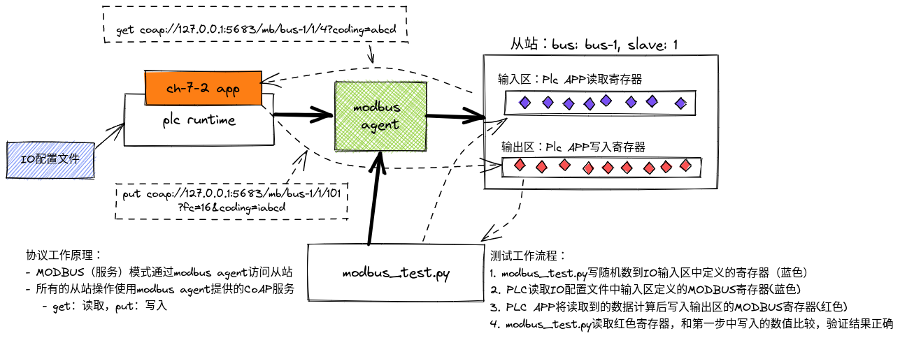
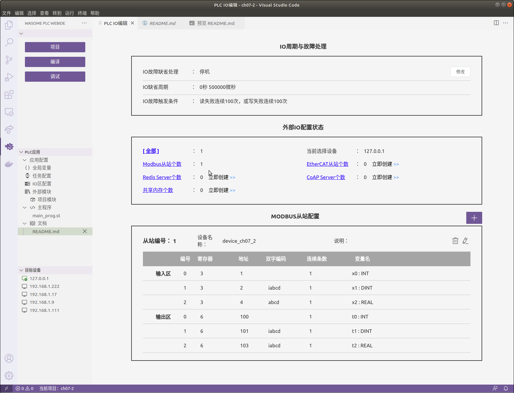
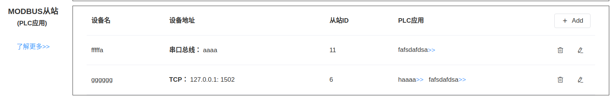

# 通过MODBUS控制示例
示例主要展示：
-	配置IO表：建立程序变量和MODBUS寄存器之间的映射关系
-	ST程序：使用读入的MODBUS数据，计算写入MODBUS的数据
-	测试程序：python脚本将读写MODBUS寄存器用来验证ST程序的执行正确性


## 测试原理



## APP IO配置
  


## 目标PLC设备上配置modbus从站
打开目标设备的WebConsole，在"设备连接配置"导航栏入口中配置要连接的MODBUS从站:  



## 测试程序 (modbus_test.py)
测试内容：
- 进程存在
- 从站设备已open
- COAP查询plc状态
- 测试程序向plc app读取的寄存器随机写入MODBUS数据，然后读取plc app的写寄存器，检查在特定时间内，数据是否满足期望。

## 执行测试
在编译打包本项目的程序后，参考IDE操作手册，执行以下测试步骤：
1. 将编译打包好的PLC APP程序部署到目标机（可以是开发机相同的主机）
2. 打开页面 http://<目标机IP>:3000/#/modbus, 点击“MODBUS从站(PLC应用)”栏的"+ Add"按钮添加从站"device_ch07_2" 
3. 确认部署的PLC实例进入运行状态
4. 确认目标机上安装了wa-agent 和 wa-plc-framework，并在运行状态
5. 执行测试程序`modbus_test.py`,如果目标机不是本机， 请替换脚本中的ip地址127.0.0.1为目标机的IP，端口号post替换为device_cha05_4的从站设备的端口号
```
   python3 modbus_test.py
```

也可以在源码调试ch07-5中，启动`modbus_test.py`来验证测试结果。

## 测试项目
PLC程序中包含了多种IO地址访问模式。


### 1: 双字节和四字节整数的访问
输入：
```
IO配置中定义目标内存地址和外部设备的数据交互：
        {
                "type": "INT",
                "reg": 3,
                "addr": 1,
                "items": 1,
                "variable": "x0"
        },
        {
                "type": "DINT",
                "reg": 3,
                "addr": 2,
                "code": "abcdi",
                "items": 1,
                "variable": "x1"
        },

```

输出：
```
IO配置中定义目标内存地址和外部设备的数据交互：
        {
                "type": "INT",
                "reg": 6,
                "addr": 100,
                "items": 1,
                "variable": "t0"
        },
        {
                "type": "DINT",
                "reg": 6,
                "addr": 101,
                "code": "abcdi",
                "fc": 16,
                "items": 1,
                "variable": "t1"
        },

```

验证方法：

- t0 = x0 + 1 ---> reg100 = reg1 +1
- t1 = x1 -1  ---> reg101 = reg2 -1

### 2 浮点
输入：

```
IO配置中定义目标内存地址和外部设备的数据交互：
        {
                "type": "REAL",
                "reg": 3,
                "addr": 4,
                "code": "abcd",
                "items": 1,
                "variable": "x2"
        },
```

输出：
```
IO配置中定义目标内存地址和外部设备的数据交互：
        {
                "type": "REAL",
                "reg": 6,
                "addr": 103,
                "code": "abcd",
                "fc": 16,
                "items": 1,
                "variable": "t2"
        },
```
验证方法：
  - x2 = 65535.56
  - t2 = x2 

### 3 BYTE[], num>1

- ST字节数组对应到多个IO连续的地址
- 测试`num` = 3
```
IO配置中定义目标内存地址和外部设备的数据交互：
        {
                "reg": 3,
                "addr": 12,
                "items": 3,
                "code": "",
                "type": "INT",
                "variable": "INPUTS"
        }
```
输出：  

```
IO配置中定义目标内存地址和外部设备的数据交互：
        {
                "reg": 6,
                "addr": 112,
                "items": 3,
                "code": "",
                "type": "INT",
                "variable": "OUTPUTS"
        },
```

验证方法：
- 输出使用跑马灯模式
- 验证输入等于输出
