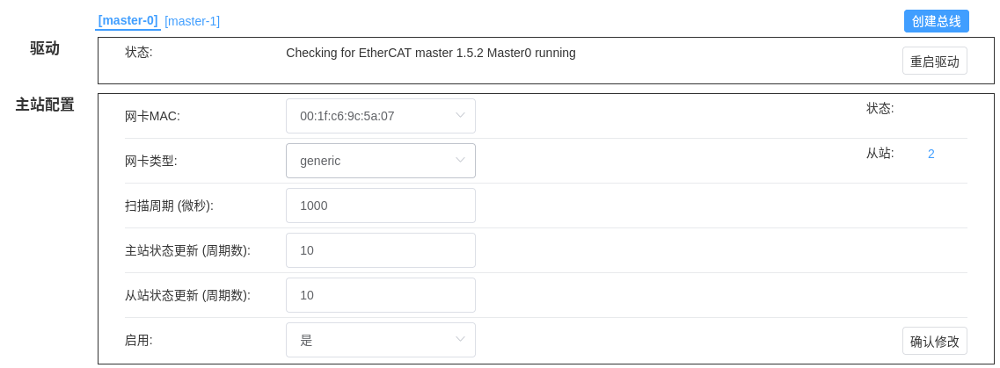
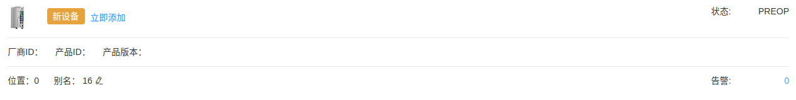
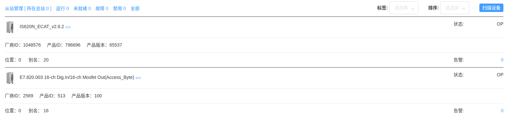
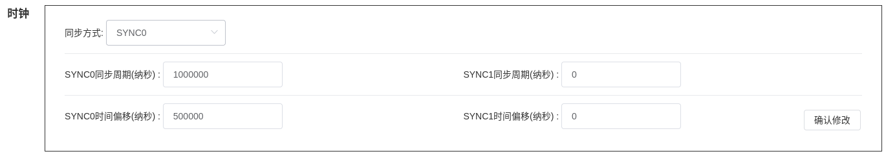
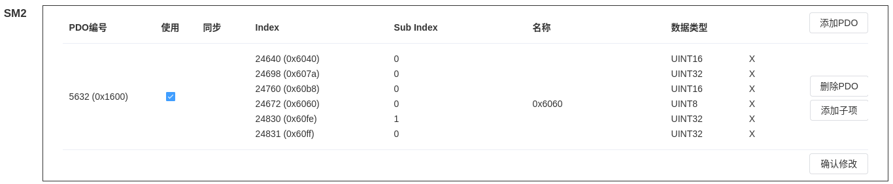

# ethercat设备控制示例

## 配置主站

从WebConsole中配置主站0，如下图所示：

## 添加从站
确认wa-plc-framework软件在`running`状态

连接从站到网络并加电，从主站下的从站列表中可以看到新发现设备：

如果从站的地址为0，先设置从站的别名地址，然后选择“立即添加”。添加后需要重新启动wa-plc-framework才能生效!设备进入OP状态：

本实例中，汇川is620n伺服的从站地址为20，数字IO模块的从站地址为16。

## 配置从站
进入IS620N从站配置，首先设置时钟：

然后配置PDO数据：

修改配置后需要wa-plc-framework才能生效!

