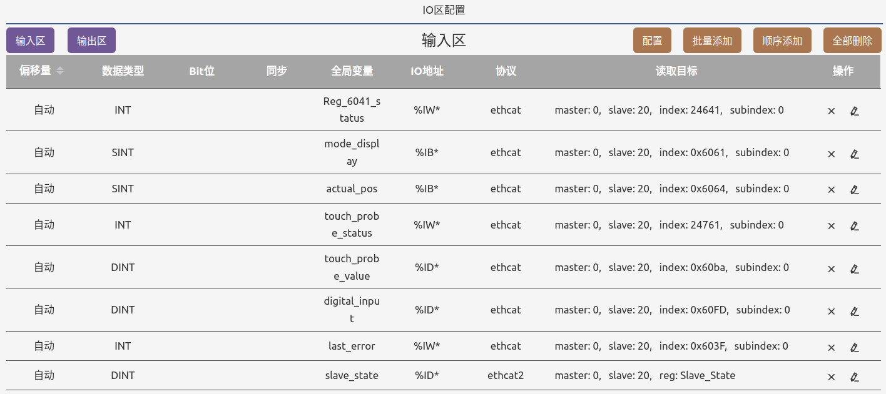
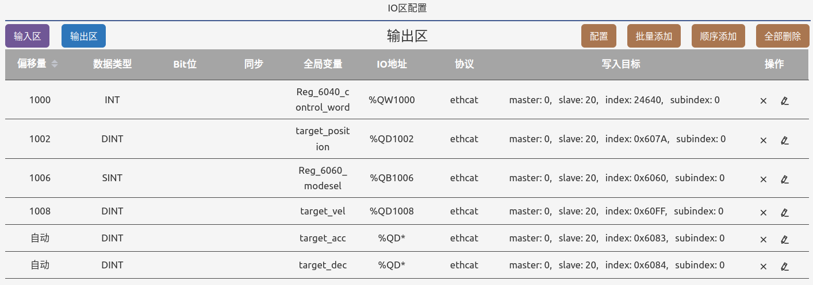

# 赛雷伺服控制

通过CSP的方式控制伺服启动。伺服型号为：DM3E-556 SERVO

## APP的IO配置

本例子使用网络配置模式中ethercat从站配置，进入IO区配置后，在ethercat下，开发者可以直接规划IO内存区的使用，手工指定每个通道在IO内存中的位置，以及对应的外部设备寄存器物理地址，如EtherCAT从站所在的主站、从站ID，数据对象索引号等。并使用类似`%QW1000`的地址模式访问。

### 输入区
输入区所有的输入通道都使用“自动”来描述IO内存位置，IDE在编译过程中会自动为该通道配置一个IO内存位置。WasomePLC要求使用了自动的通道，定义一个全局变量。这样PLC的梯形图，ST程序中使用全局变量名来使用IO通道。  
  

在IDE中点击一个通道的编辑，可以进入通道的编辑状态，如下图所示。这里`偏移量`可以输入任意整数值，或者选择下拉项“自动”。输入对应的数据类型和程序中的全局变量名称，选择协议为“ethcat”。在第二行中输入主站ID，从站ID，数据对象索引号后，确认完成编辑并退出编辑模式。  
  

### ETHERCAT从站的状态
本例子在输入区配置的通道有一个用于获取从站的在线/离线状态。如下图所示，选择协议“ethcat2”，进入使用数据对象名称（寄存器别名）的方式来访问ethercat数据。在寄存器别名变机框选择下拉项“Salve_State”，则本IO通道的全局变量名`slave_state`在程序中将提供该ethercat从站的在线/离线状态。具体从站状态数值定义参考《WasomePLC编程手册》。  
  

### 输出区
本例子的输出区展示了手工设定IO内存的位置。每一个通道在OUTPUT内存区的位置都用项目自己设定。这样程序中除了使用对应的全局变量名，还和可以使用类似`%QW1000`的地址模式访问该IO通道。
  

注意：在手工设定IO内存中，开发者需要确定通道之间在OUTPUT内存区中没有相互覆盖的现象存在。

## 目标设备上EtherCAT设备连接配置
参考例程ch07-3

## 程序设计
参考:[PROGRAM/main_program.st](./PROGRAM/main_program.st)

下面的程序打印当前的从站在线状态：  
```
WA_LOG('slave_state = %d (0X%X)', slave_state, slave_state);
```


