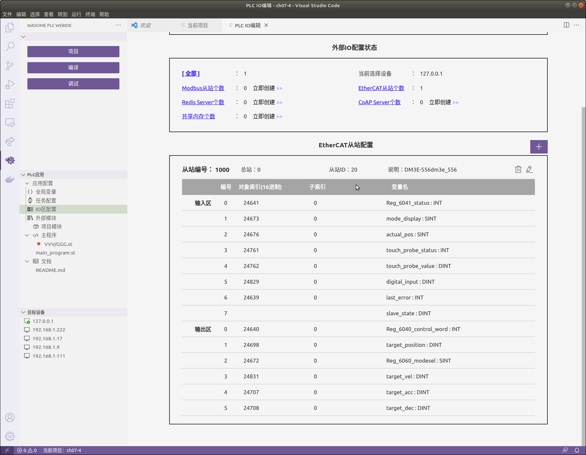

# 赛雷伺服控制

通过CSP的方式控制伺服启动。伺服型号为：DM3E-556 SERVO

## APP的IO配置

本例子使用网络配置模式中ethercat从站配置:   
  


## 目标设备上EtherCAT设备连接配置
参考例程ch07-3

## 程序设计
参考:[PROGRAM/main_program.st](./PROGRAM/main_program.st)

下面的程序打印当前的从站在线状态：  
```
WA_LOG('slave_state = %d (0X%X)', slave_state, slave_state);
```


